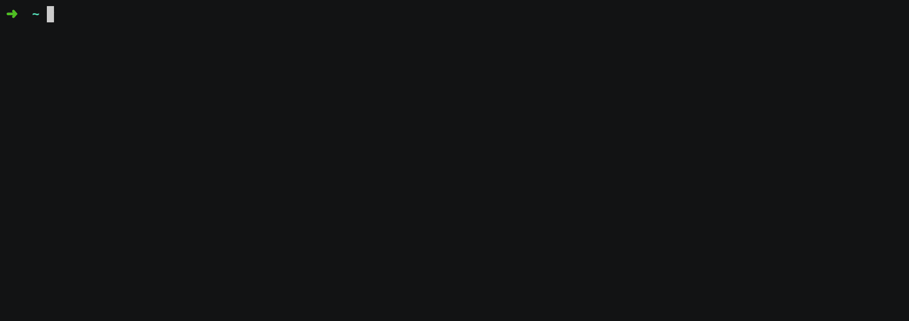

# bakerx

Bakerx is a front-end for creating and managing (micro) virtual environments. With bakerx you can quickly create a development environments to run you code. 

See a running demo below: 

<p align="center">
  
</p>

## Installation

```bash
$ npm install ottomatica/bakerx -g
```

Or, for local dev:

```bash
git clone https://github.com/ottomatica/bakerx
cd bakerx
npm install
npm link
```

## Using bakerx

### Pulling images

First, you need to pull an existing virtual machine image from a registry. Registries are basically the assets in a GitHub repository releases. Then you can pull an image by running the following commands:

```
bakerx pull ottomatica/slim#images alpine3.9-simple
```

See [slim](https://github.com/ottomatica/slim) for instructions on how to create and publish an image. 

### Creating VMs

After pulling images, you can create VMs that run those images. Simply run the command below:

```
bakerx run example_alpine_vm alpine3.9-simple --memory 2048
```

> The `--memory | -m` flag is optional, and can be used to set the amount of shared memory with your virtual machine.

### Connecting to VMs

Finally, after creating the VM, you can ssh to it by running the command below:
```
bakerx ssh example_alpine_vm
```

### Using bakerx.yml file

Instead of specifying CLI arguments when creating a VM, you can specify the details in a file called `bakerx.yml`, which is useful for storing in SCM:

```yaml
name: example_alpine_vm
image: alpine3.9-simple
up: |                      # <--- optional
  apk update
  apk add ansible
```
Then from same directory you can run `bakerx run` to create you VM.

You can also add multiple Bakerx VMs in `bakerx.yml` file, and running `bakerx run` will create them for you:
```yaml
servers:
  - name: vm1
    image: alpine3.9-simple
  - name: vm2
    image: alpine3.9-simple
```
