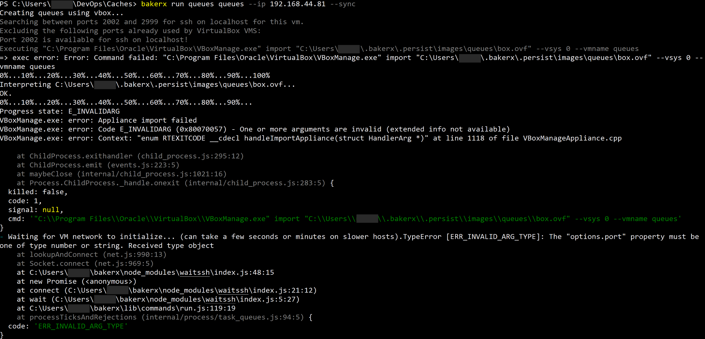
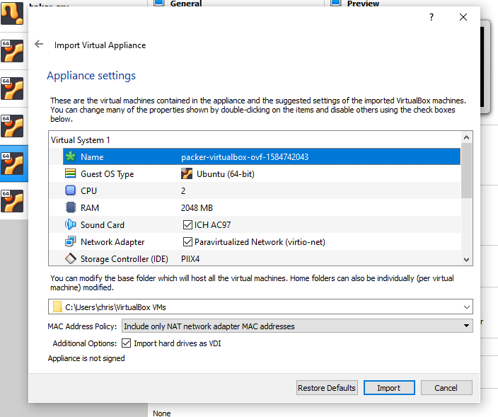

## Debugging Import Failures



To investigate why an import fails (as shown above), you will want to check some of these common issues:

### Corrupted image

You will first want to look into your images directory to ensure the image is correctly downloaded and unpacked.

This is the size I can see. Check every file to ensure the same file size.

```
C:\Users\chris\.bakerx\.persist\images\queues>ls -l
total 533726
-rw-r--r-- 1 chris 197121       258 Mar 20 18:16 Vagrantfile
-rw-r--r-- 1 chris 197121      9468 Mar 20 18:16 box.ovf
-rw-r--r-- 1 chris 197121        26 Mar 20 18:16 metadata.json
-rw-r--r-- 1 chris 197121 546444288 Mar 20 18:16 packer-virtualbox-ovf-1584742043-disk001.vmdk
-rw-r--r-- 1 chris 197121     72192 Mar 20 18:16 packer-virtualbox-ovf-1584742043-disk002.vmdk
```

### Other Errors

You might see information related to full disks, or other useful error messages in the log. You want to check the contents of the VirtualBox log:`C:\Users\<%Username%>\.VirtualBox\VBoxSVC.log`, looking for any error messages.

### Old State

- Check the contents of `C:\Users\<username>\VirtualBox VMs>` -- make sure you do not have a folder that already exists with the same name. 

- You can try deleting folder or making a vm with a new name if you see this.

### Try manual import

Another check is to see what errors you see when importing manually:
You can find your images here: `C:\Users\<username>\.bakerx\.persist\images\`


