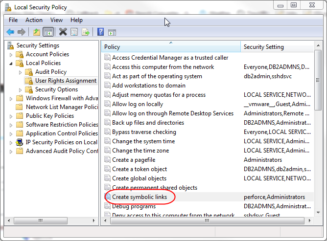

## Symlinks on Windows

If you're received a warning about symlinks on windows, this article will help you you understand why this problem occurs and how to fix it.

### Common errors

Commands such as `npm install` often will create symlinks. When inside a virtual machine within a synced folder with your host system, you may see something like this:

```bash
vagrant@ubuntu-bionic:/bakerx/meow.io$ npm install
npm ERR! code EROFS
npm ERR! syscall symlink
npm ERR! path ../acorn/bin/acorn
```

Often, the underlying issue is that `npm` attempted to create a symlink on the Windows host filesystem, but was denied!

### About symlinks

One windows, you can create a link between two files using the `mklink` command.

```
C:\> mklink link.txt ExistingFile.txt
symbolic link created for link.txt <<===>> ExistingFile.txt
```

Unfortunately, you are likely to see the following error instead:
```
C:\noprivs> mklink link.txt ExistingFile.txt
You do not have sufficient privilege to perform this operation.
```

### Security settings for symlinks in Windows

With User Account Control (UAC) enabled, the user must be given the "Create Symbolic Links" privilege or be in a group that has been given that privilege. For users within the Administrators group and with UAC on, the user must "Run as Administrator". 

While it is possible to just run everything as an Administrator to ensure you have symlink creation permission---overall, this does not create a good development environment.

### Enabling symlinks in Windows

Any user with the "Create Symbolic Links" privilege can simply create a symbolic link. 

To enable this permission, `Open Control Panel->Administrative Tools` and then open `Local Security Policy`. From there, open `Local Policies->User Rights Assignment`.

You can then make sure your user has "Create Symbolic Links" privilenge in your security policy.



You may need to refresh the Group Policy settings after changing this setting:

```
gpupdate /force
```

### Enabling Developer mode

If you have not already, you might also need to enable "Developer Mode" on your machine.

This setting is available in the Settings app. To access it, open `Settings->Update` and then `Security->For Developers` and select "Developer mode".


If you've completed these steps, you should be able to create symlinks in Windows!

